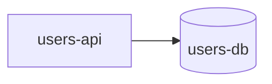
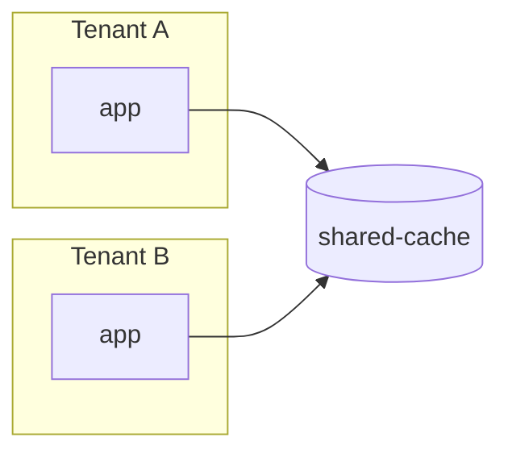

# Mermaid Diagram Standards

**Purpose:** the diagramming contract for Shamt artifacts. Mermaid is the v2 diagramming tool (replacing v1's Lucid). Text-based, GitHub/markdown-native, version-controllable, and agents generate it reliably.

For ready-to-use templates per diagram type, see `mermaid_recipes.md`.

---

## When to use Mermaid (vs ASCII)

**Use ASCII** for narrow, current-state flows that fit cleanly in a fenced code block: 3–7 nodes, one or two edges per node, no boundary crossings. ASCII renders everywhere with zero tooling overhead.

**Use Mermaid** when any of the following apply:

- The diagram crosses a service / deployment / trust boundary
- It has more than ~8 nodes or branches
- It is a sequence, state, or ER diagram (ASCII degrades fast for these)
- The story will produce or evolve the diagram as a long-lived artifact (a Mermaid block is editable; an ASCII grid is not)
- The story touches architecture (any architecture-relevant diagram is Mermaid)

When in doubt, Mermaid. The cost is low.

---

## One diagram type per use case

Pick the smallest diagram type that conveys the change. Mixing types in one diagram is a finding.

| Use case | Mermaid type | Direction |
|----------|--------------|-----------|
| Component / service boundary view (who calls whom; deployment topology) | `flowchart LR` | left-to-right |
| Data flow (what data moves where, in what order) | `flowchart TD` | top-to-bottom |
| Time-ordered interaction between actors / services | `sequenceDiagram` | left-to-right participants |
| Finite state with transitions (auth flow, order lifecycle, validation status) | `stateDiagram-v2` | n/a |
| Database / data-store schema (entities + relationships) | `erDiagram` | n/a |

Use `flowchart LR` for spatial / structural views; use `flowchart TD` when the y-axis is *time* or *pipeline order*. If a diagram could be either, prefer the one that minimizes crossing edges.

---

## Every node must be source-backed

A node in any Shamt-produced diagram represents a real, traceable thing. Before adding a node, confirm one of the following sources:

- a file path (e.g., a handler module, a config file)
- a stack / deployment resource (e.g., the project's IaC, container manifest, k8s resource)
- a database object (table, view, materialized view, queue)
- an explicit user-approved design decision recorded in the spec or context

A node with no source is a **HIGH** finding during validation.

The same rule applies to edges: each edge represents a real call, write, fetch, or transition. Speculative edges ("we might call this") are not allowed.

---

## Node naming

- **Shape and node ID:** use a stable `kebab-case` ID that doubles as the lookup key in the spec / context. Render the human label with `id["Label"]` syntax.
- **Labels:** short, specific noun phrases. `users-api` not `the users service`. Subject-specific names beat generic ones (`order-status-worker` not `worker`).
- **Avoid abbreviations** unless they appear in the project's `.shamt-core/project-specific-files/CODING_STANDARDS.md` or `.shamt-core/project-specific-files/ARCHITECTURE.md`.
- **Plural vs singular:** match the project convention; if none, prefer singular for resources (`order`, not `orders`).

Example:

The IDs (`api`, `db`) are local to the diagram; the labels (`users-api`, `users-db`) match the names used in code and spec prose.

---

## Containers and boundaries

Use `subgraph` to draw service, account, network, or trust boundaries. Name the boundary explicitly; do not rely on visual proximity alone.

Every boundary you draw must correspond to a real isolation boundary (a VPC, a tenant scope, a process boundary). Decorative grouping is a **MEDIUM** finding.

---

## Edge labels

- Label edges with the *interaction kind*, not the data payload: `HTTP GET`, `publish`, `read`, `write`, `subscribe`, `enqueue`. Payload details belong in `spec.md` / `context.md`.
- Direction is meaningful: an arrow from A → B means A initiates the interaction.
- If two edges share a direction and source, prefer one labeled edge over two unlabeled edges of similar meaning.
- No edges through nodes. If you cannot route around a node, the diagram is too dense — split into two diagrams.

---

## State and ER specifics

**`stateDiagram-v2`:**

- Every state has at least one entry edge (except the initial state, marked `[*] --> state-name`).
- Every state has at least one exit edge (except terminal states, marked `state-name --> [*]`).
- Transition labels name the *event*, not the action taken on transition.

**`erDiagram`:**

- Cardinality is required on every relationship (`||--o{`, `}o--||`, etc.).
- Include only the columns relevant to the story; do not redraw the full schema. The spec lists the columns the story touches.

---

## Source contract

Every diagram in a spec or context lives next to its Mermaid source. Do not embed a screenshot or external link in place of source. Reasons:

- The diagram travels with the story under version control.
- Reviewers can edit the diagram during validation without round-tripping through an external tool.
- The next agent reading the artifact can re-render or diff the diagram.

Render verification: when an existing Mermaid diagram is recorded in `active_artifacts.md`, the spec validation confirms it renders (no syntax errors), every node and edge is source-backed, it does not contradict spec / context, and it conforms to this file. See `validation_exit_criteria.md` for the dimension list.
