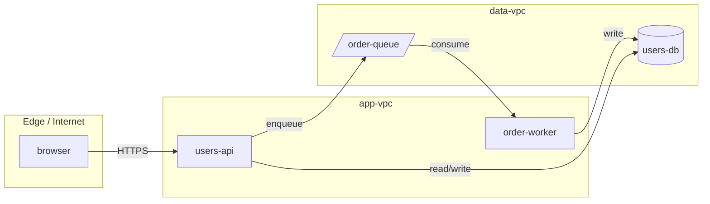
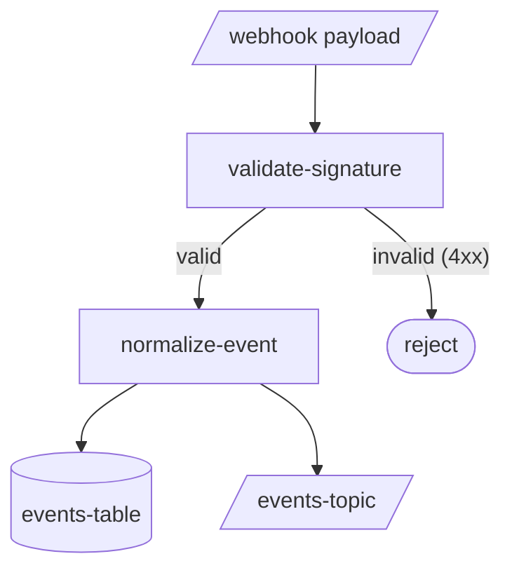
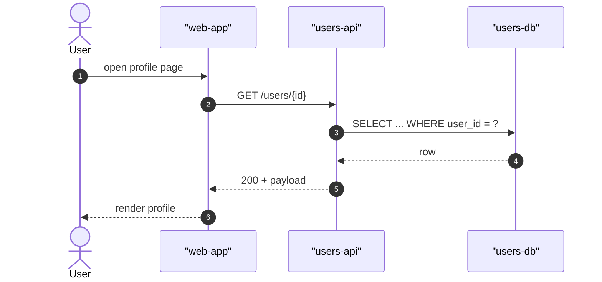
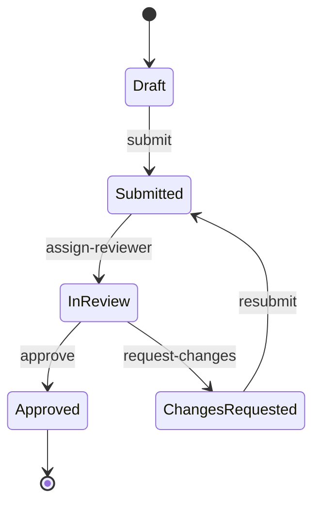
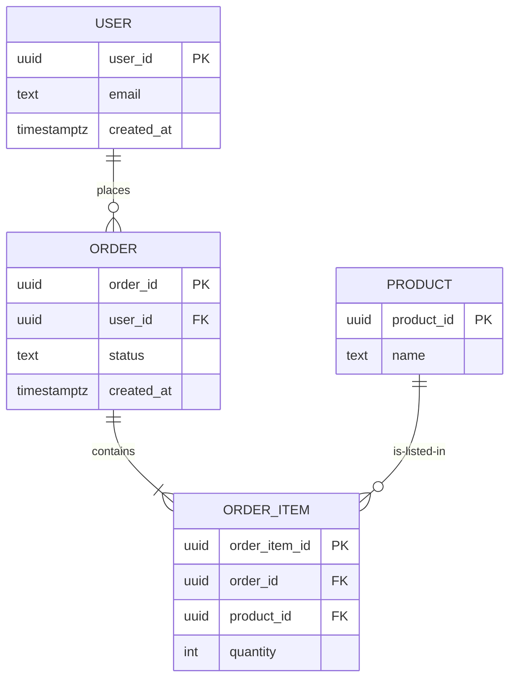

# Mermaid Recipes

Ready-to-copy Mermaid templates for the five diagram types Shamt artifacts use. Each recipe shows the source block first, then the rules / variants for that type.

For governance (when to draw, naming, boundary, source-backed-node rule), see `mermaid_diagram_standards.md`.

---

## 1. Component / Boundary View — `flowchart LR`

**Use when:** structural / spatial view of services, modules, deployment units. Who calls whom; what crosses a trust or network boundary.

**Variants:**

- Add a `subgraph` per account / tenant / VPC for explicit boundaries.
- Use shape decorators: `[]` for service, `[()]` for database, `[/.../]` for queue, `(())` for actor, `>"text"]` for documents.
- For deployment topology, add a tag in the label: `api["users-api · prod"]`.

**Anti-patterns:**

- Mixing components and data flow on the same diagram. Split into two diagrams instead.
- Drawing every dependency. Focus on the change: nodes and edges the story touches.

---

## 2. Data Flow — `flowchart TD`

**Use when:** the diagram is *temporally or pipeline-ordered* and reads top-to-bottom.

**Variants:**

- Decision diamonds: `decision{"valid?"}` followed by labeled outgoing edges (`yes` / `no`).
- Terminal states: `result([final state])`.

**Anti-patterns:**

- Drawing more than one swim of execution in one diagram. Use `sequenceDiagram` if multiple actors interact.
- Crossing edges. Re-order nodes or split the diagram if crossings appear.

---

## 3. Time-ordered Interaction — `sequenceDiagram`

**Use when:** multiple actors / services interact over time; ordering and per-step responses matter.

**Variants:**

- `alt` / `else` / `end` for branching cases.
- `loop` for repeated interactions.
- `Note over X,Y: text` to annotate without adding a participant.

**Anti-patterns:**

- Using sequence diagrams for static structure. Use `flowchart LR` for that.
- Showing every internal call. Stop at the boundary the story touches.

---

## 4. State Machine — `stateDiagram-v2`

**Use when:** the artifact has a finite set of states with named transitions: auth flow, order lifecycle, validation status, story phases.

**Variants:**

- `note left of state-name: text` for invariants.
- Composite states with `state name { ... }` for nested machines.

**Anti-patterns:**

- Mixing states with components. If you find yourself drawing the system that produces the state, that belongs in a separate diagram.
- Unreachable states. Every state needs an entry edge (or to be the initial state).

---

## 5. Schema — `erDiagram`

**Use when:** the story changes a database / data-store schema. Show only the entities and relationships the story touches.

**Variants:**

- Cardinality cheat: `||--||` (one-to-one), `||--o{` (one-to-many), `}o--o{` (many-to-many).
- Add only the columns the story uses; the spec's `## Schema changes` section lists the full surface.

**Anti-patterns:**

- Redrawing the full schema. Reviewers should see only the entities and columns affected.
- Omitting cardinality. Every relationship needs `||--o{` (or similar) on both ends.

---

## Putting recipes into specs

In a Standard-path `spec.md`, every architectural / data-shape claim that travels through multiple nodes warrants a Mermaid diagram in its own code block. Place the diagram immediately after the prose that introduces it. Keep the prose explanatory; let the diagram carry the structure.

In a Quick-path `spec.md`, prefer ASCII for narrow flows. Escalate to Mermaid the moment a boundary crosses or the node count exceeds ~8.
